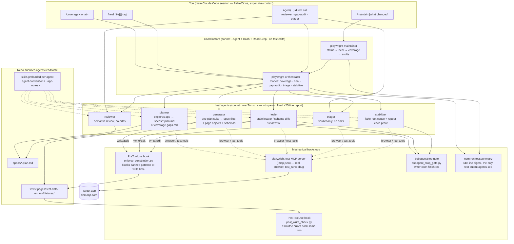
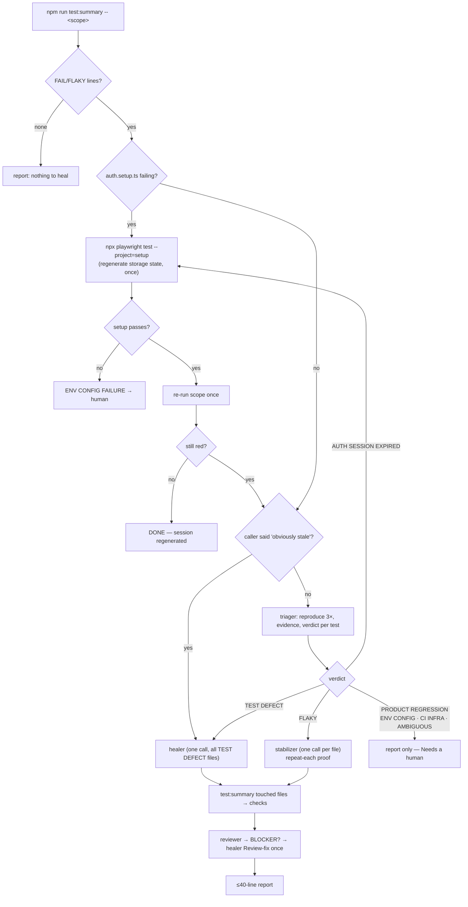
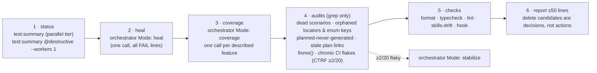
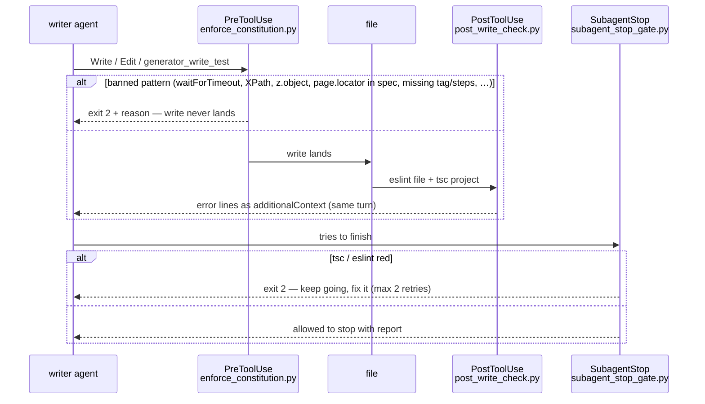

# Architecture — the agentic pipeline

How the pieces in `.claude/` fit together, and what happens step by step when you type
`/coverage`, `/heal`, or `/maintain`. Diagrams are Mermaid; GitHub and most editors render them.
The rules themselves live in `CLAUDE.md`; this file is the map, not the law.

## 1. Layers



**Invariants the diagram encodes**

- The main session makes **one** `Agent` call and gets **one** short report. It never reads raw
  Playwright output or drives a leaf agent through a multi-step conversation.
- Coordinators never write test code. Leaf writer agents (generator, healer, stabilizer) are the
  only things that touch `tests/`, `pages/`, `test-data/`, `enums/`, and every one of their writes
  passes through the PreToolUse hook and the PostToolUse check, then the SubagentStop gate.
- Analysis agents (triager, reviewer) have no edit tools at all — a verdict or finding that reads
  like a code change is drift, and the fix is routed back through the healer/stabilizer.
- Leaf agents run **sequentially**; the MCP browser is a single shared instance.
- Nothing loops. Each pipeline gets one heal pass, one review-fix pass, one auth regeneration.
  A still-red result is reported, not retried.

## 2. `/coverage <what>` — plan → generate → run → heal → review

```mermaid
sequenceDiagram
    autonumber
    participant U as main session
    participant O as orchestrator
    participant P as planner
    participant G as generator
    participant SUM as test:summary
    participant H as healer
    participant R as reviewer

    U->>O: Mode: coverage. Task: …
    O->>P: task + seed + plan path
    P->>P: inventory specs, page getters, planned scenarios
    P->>P: explore live app (snapshots), capture API Response shape
    P-->>O: specs/&lt;slug&gt;.plan.md (report)
    O->>O: Grep "^### " → suite list
    loop each suite, sequentially
        O->>G: &lt;generate&gt;&lt;plan-file/&gt;&lt;suite/&gt;&lt;seed-file/&gt;
        G->>G: locators from inventory → page object / component
        G->>G: schema · factory · messages before the spec
        G->>G: drive scenario live → generator_write_test (hook-checked)
        G-->>O: files written
    end
    O->>SUM: generated files (+ @destructive ones with --workers 1)
    alt FAIL lines
        O->>H: FAIL lines + files (once)
        H-->>O: fixed / fixme left
        O->>SUM: re-run once
    end
    O->>O: format · typecheck · lint · skills-drift
    O->>R: touched files
    R-->>O: BLOCKER / SHOULD-FIX / NIT
    opt BLOCKER
        O->>H: Review-fix: &lt;lines&gt; (once)
        O->>O: re-run checks
    end
    O-->>U: ≤40-line report
```

## 3. `/heal [scope]` — summarize → triage → route → fix → review



## 4. `/maintain [what changed]` — the periodic pass



Depth: main → maintainer → orchestrator → leaf is three layers, the default
`CLAUDE_CODE_MAX_SUBAGENT_SPAWN_DEPTH`.

## 5. What a single write goes through



The hook is a **backstop**, not the spec: it only blocks what regex can detect cheaply
(`npm run check:hook` self-tests it). The reviewer covers the semantic remainder.

## 6. Agent roster

| Agent                         | Model  | Turns | Browser | Writes                                         | Preloaded skills                                                                        |
| ----------------------------- | ------ | ----- | ------- | ---------------------------------------------- | --------------------------------------------------------------------------------------- |
| `playwright-maintainer`       | sonnet | 30    | no      | nothing                                        | agent-conventions, maintenance, flaky-tests                                             |
| `playwright-orchestrator`     | sonnet | 40    | no      | nothing (runs `--project=setup`)               | agent-conventions, maintenance                                                          |
| `playwright-test-planner`     | sonnet | 50    | explore | `specs/*.plan.md`, app-notes                   | agent-conventions, app-notes                                                            |
| `playwright-test-generator`   | sonnet | 60    | drive   | specs, page objects, components, schemas, data | agent-conventions, app-notes                                                            |
| `playwright-test-healer`      | sonnet | 40    | debug   | page objects, schemas, specs (`fixme`)         | agent-conventions, app-notes                                                            |
| `playwright-test-triager`     | sonnet | 25    | debug   | nothing                                        | agent-conventions, app-notes, failure-triage                                            |
| `playwright-flaky-stabilizer` | sonnet | 40    | debug   | specs, page objects                            | agent-conventions, app-notes, flaky-tests                                               |
| `playwright-test-reviewer`    | sonnet | 20    | no      | nothing                                        | agent-conventions, app-notes, page-objects, locators-assertions, tagging, data-strategy |

Every leaf ends with the fixed report from `agent-conventions` (or its own ≤30-line template);
coordinators merge those, never paste them.

## 7. Candidate agents (not built — add when the trigger fires)

Each one is cheap to add (a `.claude/agents/*.md` file plus a line in `CLAUDE.md`); none is
worth its context cost until the trigger below actually happens.

| Candidate                     | What it would do                                                                                                                                   | Add when                                                                                           | Until then                                                                               |
| ----------------------------- | -------------------------------------------------------------------------------------------------------------------------------------------------- | -------------------------------------------------------------------------------------------------- | ---------------------------------------------------------------------------------------- |
| `playwright-a11y-auditor`     | Run axe-core per page object, file findings by WCAG rule, propose the assertion (`toHaveAccessibleName`, contrast) that would catch the regression | The target is an app you own and a11y is a release gate                                            | The `lighthouse` project already scores accessibility per page                           |
| `playwright-perf-baseliner`   | Read `lighthouse-report/*.json` across CI runs, propose tightened per-page thresholds in `helpers/lighthouse.ts`, flag a real score drop           | Lighthouse thresholds have been stable for ~20 runs                                                | Thresholds are hand-set floors                                                           |
| `playwright-visual-reviewer`  | Own `toHaveScreenshot` baselines: approve/reject diffs from a CI artifact, explain what changed in the accessibility tree at the same spot         | The app has a design system you control and visual drift matters                                   | No visual tests exist; demoqa is ad-heavy and would flake                                |
| `playwright-ci-analyst`       | Pull the last N CTRF/JUnit artifacts, trend pass rate / duration / flake rate per test, hand the maintainer a ranked list instead of a ≥2/20 grep  | CI history is long enough that the maintainer's chronic-flake grep is too coarse                   | Maintainer step 4 does the one-number version                                            |
| `playwright-data-steward`     | Audit the shared test account's state before a destructive run (leftover books, orphan records), reset it, and own the factories' realism          | More than one shared mutable resource exists, or `@destructive` runs start colliding               | `createdBook` cleanup + `lock: 'bookstore-collection'` cover the single shared resource  |
| `playwright-contract-watcher` | Diff live API responses against every `test-data/schemas/*.ts` on a schedule and open a heal with the exact field delta before a test fails        | The API changes faster than the nightly full suite catches it                                      | Healer already fixes schema drift once a test fails; triager can call endpoints directly |
| `playwright-release-scribe`   | Run the pre-PR checklist, bump `VERSION`/`CHANGELOG`, open the PR with the test-plan checklist filled from actual runs                             | Only if the repo drops its human-triggered-PR preference (`.claude/skills/pull-requests/SKILL.md`) | `/code-review` + the checklist skill                                                     |

The one deliberately **not** on the list is a "fix everything and commit" agent: the Golden
rule (verify → commit → proceed) keeps the commit with the human, and every coordinator above
stops at a report for that reason.

## 8. Reading order for a newcomer

1. `CLAUDE.md` — the ten rules and the agent list.
2. This file — the shape.
3. `.claude/skills/agent-conventions/SKILL.md` — what every leaf agent actually sees.
4. `.claude/agents/playwright-orchestrator.md` — the pipeline in prose.
5. `.claude/skills/maintenance/SKILL.md` — when to reach for which entry point.
